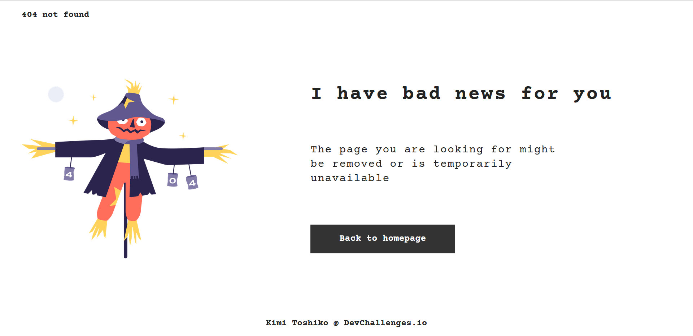

<!-- Please update value in the {}  -->

<h1 align="center">404 Page Not Found</h1>

   Solution for a challenge from  <a href="http://devchallenges.io" target="_blank">Devchallenges.io</a>.

  <h3>
    <a href="https://kimi-toshiko.github.io/DevChallenges/404-not-found/">
      Demo
    </a>
     | 
    <a href="https://github.com/Kimi-Toshiko/DevChallenges/tree/404-not-found">
      Solution
    </a>
     | 
    <a href="https://devchallenges.io/challenges/wBunSb7FPrIepJZAg0sY">
      Challenge
    </a>
  </h3>

<!-- TABLE OF CONTENTS -->

## Table of Contents

- [Overview](#overview)
  - [Built With](#built-with)
- [Features](#features)
- [Contact](#contact)
- [Acknowledgements](#acknowledgements)

<!-- OVERVIEW -->

## Overview

The demo of this page can be seen in the links above.

Creation of this page was pretty easy. The only thing that annoyed me a little bit, was how to make the picture look of the normal size on each type and size of the screen.

I have practiced skills, which were a bit forgottent before.

### Built With

<!-- This section should list any major frameworks that you built your project using. Here are a few examples.-->

- [Sass](https://sass-lang.com/)

## Features

<!-- List the features of your application or follow the template. Don't share the figma file here :) -->

This application/site was created as a submission to a [DevChallenges](https://devchallenges.io/challenges) challenge. The [challenge](https://devchallenges.io/challenges/wBunSb7FPrIepJZAg0sY) was to create a page with 404 error.

## Contact

- GitHub [Kimi-Toshiko](https://github.com/Kimi-Toshiko)
