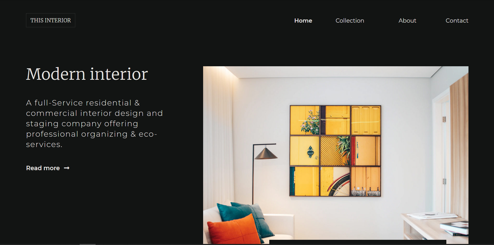

<!-- Please update value in the {}  -->

<h1 align="center">Interior Consultant</h1>

   Solution for a challenge from  <a href="http://devchallenges.io" target="_blank">Devchallenges.io</a>.

  <h3>
    <a href="https://kimi-toshiko.github.io/DevChallenges/interior-consultant/">
      Demo
    </a>
     | 
    <a href="https://github.com/Kimi-Toshiko/DevChallenges/tree/interior-consultant">
      Solution
    </a>
     | 
    <a href="https://devchallenges.io/challenges/Jymh2b2FyebRTUljkNcb">
      Challenge
    </a>
  </h3>

<!-- TABLE OF CONTENTS -->

## Table of Contents

- [Overview](#overview)
  - [Built With](#built-with)
- [Features](#features)
- [Contact](#contact)
- [Acknowledgements](#acknowledgements)

<!-- OVERVIEW -->

## Overview

The demo of the website can be seen through the link above in the 'demo' section.

The challenge was to create a responsive webpage on the theme of interior design. One of the main features was creation of hamburger menu, which would be working properly. Creating it was fun, I had a chance to remember the rules of working with animations and jquery.

Thorugh this lesson I have remembered and made stronger knowledge about CSS animations, their working flow, main rules and correct appliance to the web page to make everything work smoothly and correctly.

### Built With

<!-- This section should list any major frameworks that you built your project using. Here are a few examples.-->

- [jQuery](https://jquery.com/)
- [Sass](https://sass-lang.com/)

## Features

<!-- List the features of your application or follow the template. Don't share the figma file here :) -->

This application/site was created as a submission to a [DevChallenges](https://devchallenges.io/challenges) challenge. The [challenge](https://devchallenges.io/challenges/Jymh2b2FyebRTUljkNcb) was to build an application to complete the given user stories.

## Acknowledgements

<!-- This section should list any articles or add-ons/plugins that helps you to complete the project. This is optional but it will help you in the future. For exmpale -->

- [CSS Animations](https://css-tricks.com/almanac/properties/a/animation/)
- [jQuery](https://jquery.com/)
- [jQuery CheatSheet](https://oscarotero.com/jquery/)
- [Sass](https://sass-lang.com/)

## Contact

- Website [CV](https://kimi-toshiko.github.io/rsschool-cv/)
- GitHub [@kimi-toshiko](https://github.com/Kimi-Toshiko)
